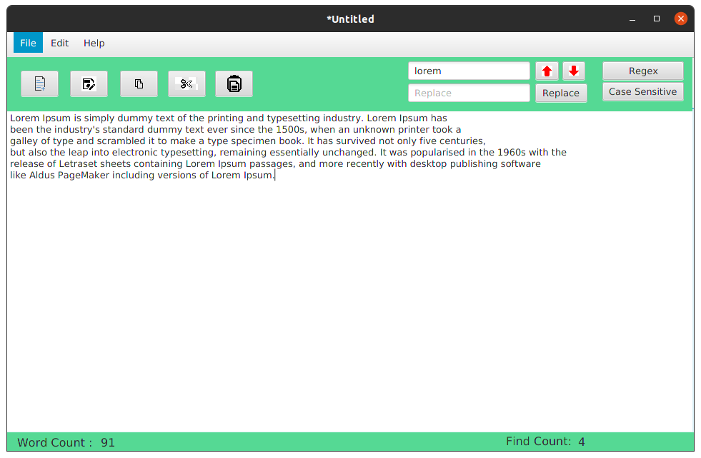

#Final Edit

  
Table of Contents

  <ol>
    <li>
      <a href="#about-the-project">About The Project</a>
    </li>
    <li>
      <a href="#getting-started">Getting Started</a>
      <ul>
        <li><a href="#installation">Installation</a></li>
      </ul>
    </li>
    <li><a href="#usage">Usage</a></li>
    <li><a href="#license">License</a></li>
    <li><a href="#contact">Contact</a></li>
    <li><a href="#acknowledgements">Acknowledgements</a></li>
  </ol>

## About The Project

* This is a Simple Text Editing software developed by me to learn,demonstrate and pratice many forms in **JavaFx Applications** and **Java SE** related programmes.

##Getting Started

1. First clone the repository.
   https://github.com/DulangaM2W/Text-Editor.git

2. Once cloned, open the repository from the IntelliJ IDEA

3. Then build and Run!

## Usage

* This editor can find and replace the text that the user has entered.
* It can also read and write files.
* After editing, the user can print it.

## License

Copyright &copy; 2022 - present Dulanga Wimalagunasekara. All rights reserved.

Licensed under the [MIT](LICENSE) license.

## Contact

Dulanga Wimalagunasekara - [Twitter](https://twitter.com/MalshanDulanga) - dulangawimalagunasekara@gmail.com

[Project](https://github.com/DulangaM2W/Text-Editor.git)

